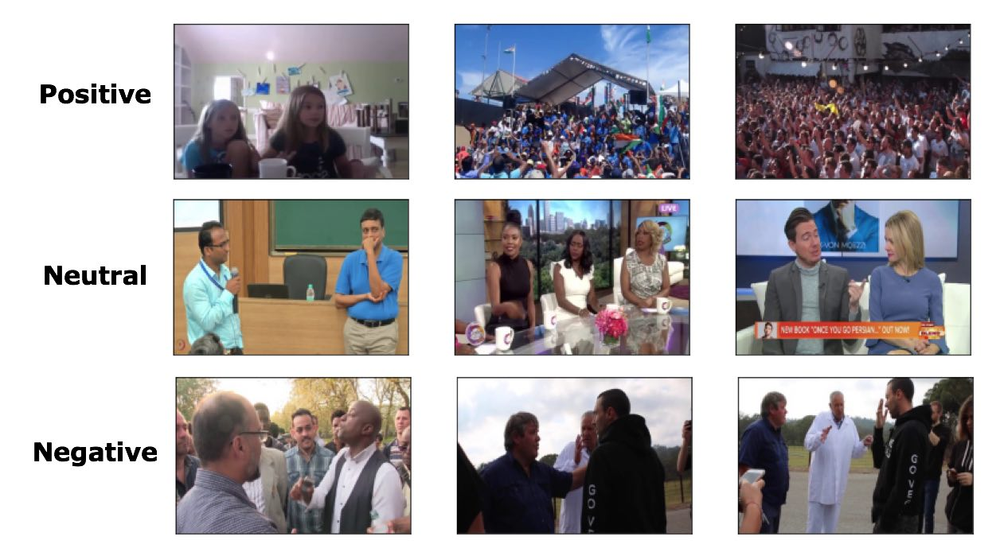
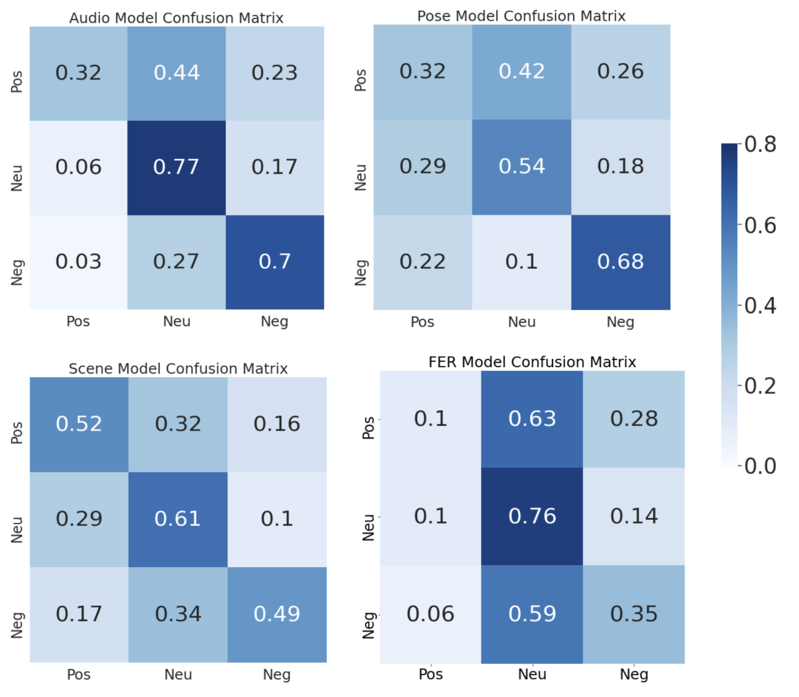
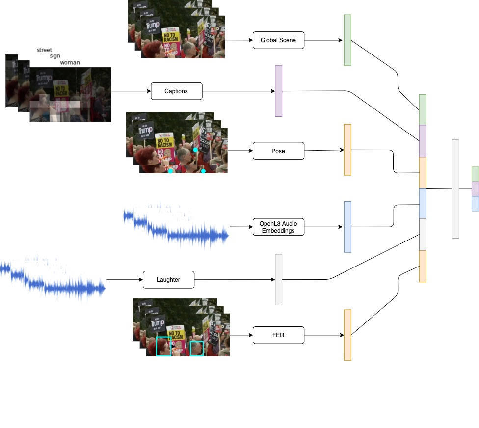

# CS231n - Multimodal Video Sentiment Classification on EmotiW 2020

## Introduction
Despite cultural diversity, emotions are universal. We will undertake the EmotiW challenge, doing group-level sentiment recognition on videos from across the globe. Given short clips, the goal is to predict whether the video sentiment is positive, neutral, or negative. This problem is interesting because audio-visual sentiment analysis has implications in psychology and mental health.

## Dataset
We worked with the EmotiW 2020 dataset.



## Getting Started

To start, please check out our [paper](report.pdf), [presentation](https://drive.google.com/file/d/15s1jfWtt37JV1BQu1e2gvfaTqEdFsgOK/view?usp=sharing), and [slide deck](https://docs.google.com/presentation/d/1rHWnZwHUW6CVbl7qutWYIRriGZnI6RD6-AfmcoQ0yJc/edit).

### Code Layout
The code is organized as follows:
- src/ - preprocessing, generation, and classification code
- notebooks/ - notebooks for training and prediction

### Try it out
Run this [notebook]() to see how our model works on the dataset

## Results
Confusion matrix / table


### Architecture
We ensembled models from four modalities: overall scene, pose, audio, and facial.



## The Team
Boyang Tom Jin, Leila Abdelrahman, Cong Kevin Chen, Amil Khanzada<br>
[CS231n - Stanford University](http://cs231n.stanford.edu/)

## Citing Our Work
```
@{}
```
